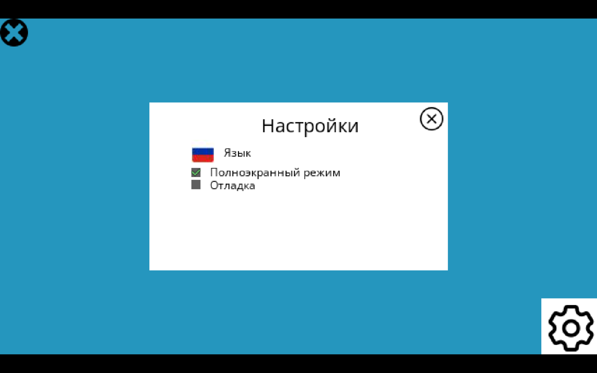
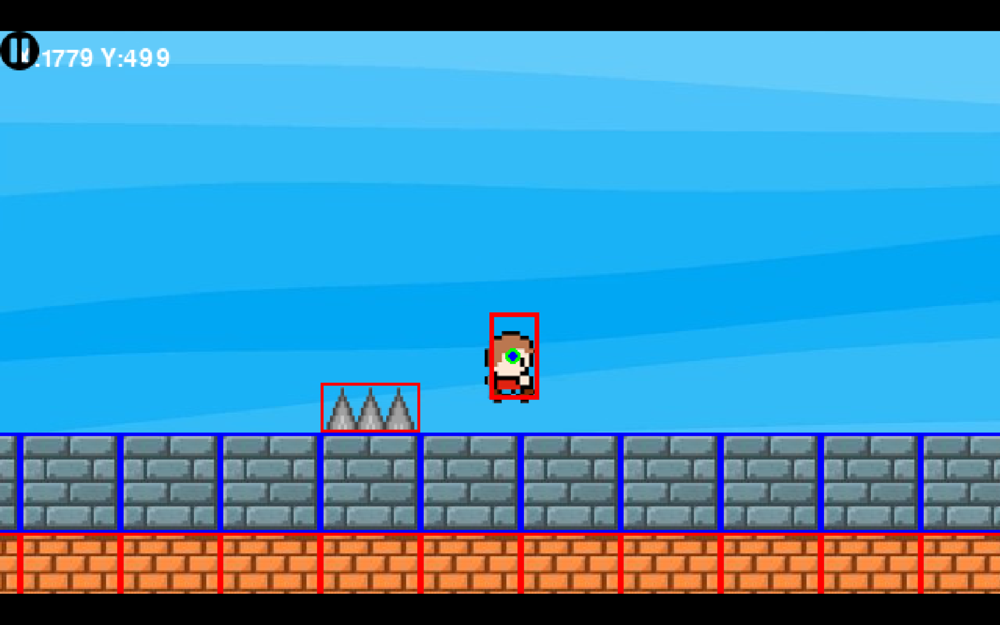
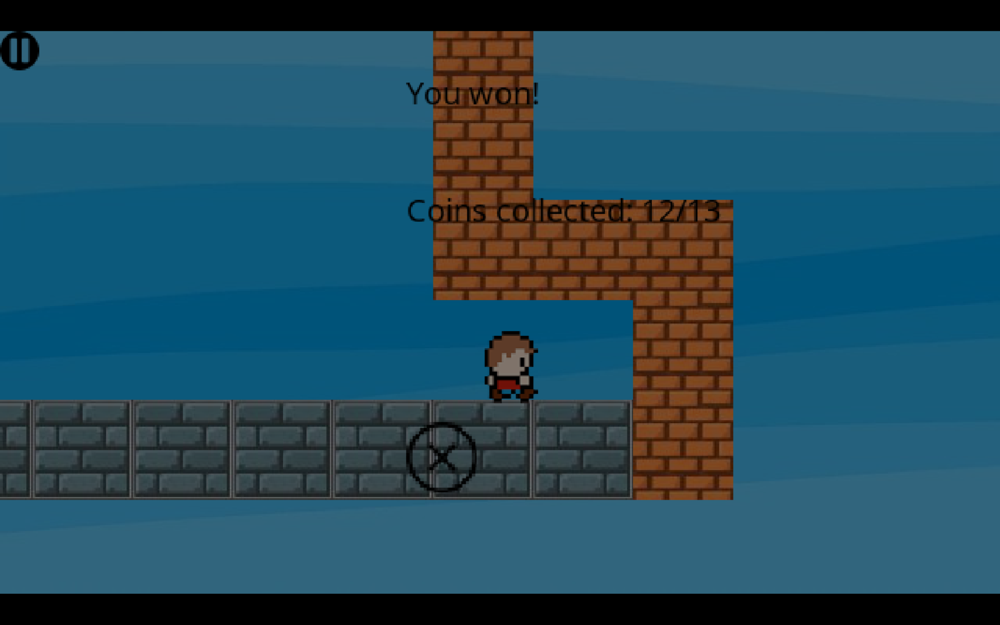

# 2D платформер написанный на Python, PyGame

- **Один играбельный уровень** (скоро будет добавлено больше)
- **Два языка** - Английский и Русский

## Механики
- **Coyote time (койот тайм)** - возможность прыгнуть после падения с платформы
- **Jump buffer (буфер прыжка)** - запоминание нажатия на прыжок перед приземлением
- **Меню паузы**
- **Меню смерти**
- **Меню победы**
- **Режим отладки** - показ хитбоксов (в настройках)

## Управление
- A/D - передвижение
- SPACE - прыжок
- ESC - пауза
- F1 - переключение полноэкранного режима

## Геймплей - скриншоты и гифки

## Установка
1. Скачайте файл `SIBGames.zip`
2. Распакуйте его
3. Откройте `SIBGames/pythonProject/`
4. Запустите `Main.exe` (Python и сторонние библиотеки устанавливать не нужно)

## Системные требования 
- **ОС:** Windows 10/11
- **Процессор:** 1.5 ГГц
- **ОЗУ:** 512 МБ
- **Видеокарта:** Любая (DirectX 9 compatible)
- **Место на диске:** 189 МБ

## 🙏 Спасибо
- Python, Pygame
- Google Fonts (Open Sans)
- Flaticon, Iconfinder
- Различным бесплатным источникам (Pinterest, и др.)

## Лицензия
**MIT** — бесплатно использовать, модифицировать, распространять.  
Создано как учебный материал для начинающих.
